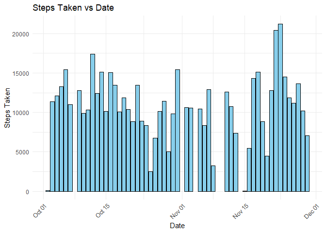
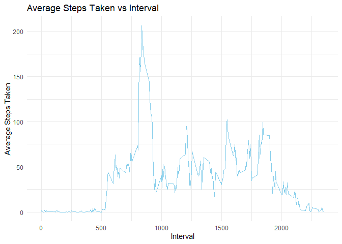
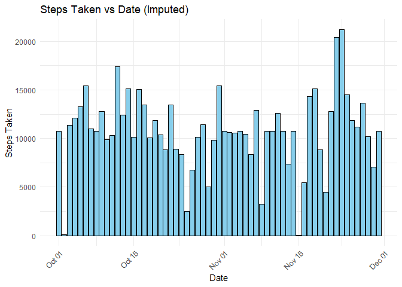
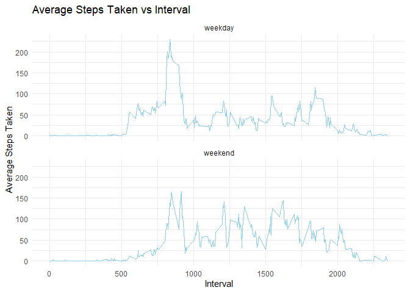

## Importing required libraries

``` r
library(ggplot2)
```

## Loading and preprocessing the data
### 1. Loading Data

``` r
unzip("activity.zip")  # Unzip the data
activity <- read.csv("activity.csv")
str(activity)
```

```
## 'data.frame':	17568 obs. of  3 variables:
##  $ steps   : int  NA NA NA NA NA NA NA NA NA NA ...
##  $ date    : chr  "2012-10-01" "2012-10-01" "2012-10-01" "2012-10-01" ...
##  $ interval: int  0 5 10 15 20 25 30 35 40 45 ...
```
### 2. Preprocessing Data
Since the date column is in string format, we need to convert it to date class.

``` r
activity$date <- as.Date(activity$date)  # Convert date column to date class from string
str(activity)
```

```
## 'data.frame':	17568 obs. of  3 variables:
##  $ steps   : int  NA NA NA NA NA NA NA NA NA NA ...
##  $ date    : Date, format: "2012-10-01" "2012-10-01" ...
##  $ interval: int  0 5 10 15 20 25 30 35 40 45 ...
```


## What is mean total number of steps taken per day?
First, we calculate the total number of steps taken per day

``` r
total_steps_per_day <- aggregate(steps ~ date, activity, sum)
```
### 1. Histogram

``` r
ggplot(total_steps_per_day, aes(x = date, y = steps)) +
  geom_col(fill = "skyblue", color = "black") + # Histogram-like bar plot
  labs(
    title = "Steps Taken vs Date",
    x = "Date",
    y = "Steps Taken"
  ) +
  theme_minimal() +
  theme(axis.text.x = element_text(angle = 45, hjust = 1))
```

<!-- -->
  
### 2. Mean and Median

``` r
mean_steps <- format(mean(total_steps_per_day$steps), scientific = FALSE)
median_steps <- format(median(total_steps_per_day$steps), scientific = FALSE)
```
Mean: 10766.19  
Median: 10765

## What is the average daily activity pattern?
First, we calculate the average number of steps taken in each interval

``` r
average_steps_per_interval <- aggregate(steps ~ interval, activity, mean)
```
### 1. Time Series Plot

``` r
ggplot(average_steps_per_interval, aes(x = interval, y = steps)) +
  geom_line(color = "skyblue") + # Time series plot
  labs(
    title = "Average Steps Taken vs Interval",
    x = "Interval",
    y = "Average Steps Taken"
  ) +
  theme_minimal()
```

<!-- -->

### 2. Interval with the maximum number of steps

``` r
max_interval <- average_steps_per_interval[which.max(average_steps_per_interval$steps), "interval"]
```
Interval with the maximum number of steps: 835


## Imputing missing values
### 1. Number of missing values

``` r
missing_values_count <- sum(is.na(activity))
```
### 2. Strategy for filling missing values
We will fill the missing values with the average number of steps taken in that interval.

### 3. Filling missing values

``` r
activity_imputed <- merge(activity, average_steps_per_interval, by = "interval", suffixes = c("", "_avg"))
activity_imputed$steps <- ifelse(is.na(activity_imputed$steps), activity_imputed$steps_avg, activity_imputed$steps)
activity_imputed <- activity_imputed[, -ncol(activity_imputed)]
```
### 4. Histogram

``` r
total_steps_per_day_imputed <- aggregate(steps ~ date, activity_imputed, sum)
ggplot(total_steps_per_day_imputed, aes(x = date, y = steps)) +
  geom_col(fill = "skyblue", color = "black") + # Histogram-like bar plot
  labs(
    title = "Steps Taken vs Date (Imputed)",
    x = "Date",
    y = "Steps Taken"
  ) +
  theme_minimal() +
  theme(axis.text.x = element_text(angle = 45, hjust = 1))
```

<!-- -->


## Are there differences in activity patterns between weekdays and weekends?

### 1. Creating a new factor variable

``` r
activity_imputed$day <- weekdays(activity_imputed$date)
activity_imputed$day_type <- ifelse(activity_imputed$day %in% c("Saturday", "Sunday"), "weekend", "weekday")
activity_imputed$day_type <- factor(activity_imputed$day_type, levels = c("weekday", "weekend"))
```

### 2. Panel Plot

``` r
average_steps_per_interval_imputed <- aggregate(steps ~ interval + day_type, activity_imputed, mean)
ggplot(average_steps_per_interval_imputed, aes(x = interval, y = steps)) +
  geom_line(color = "skyblue") + # Time series plot
  labs(
    title = "Average Steps Taken vs Interval",
    x = "Interval",
    y = "Average Steps Taken"
  ) +
  facet_wrap(~day_type, ncol = 1) +
  theme_minimal()
```

<!-- -->
